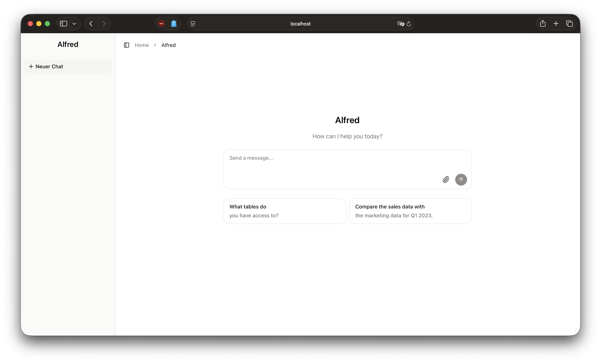

# Alfred

Open source is a foundation for modern data systems. Alfred is a snapshot of a an AI-powered data assistant for domain adoption powered by semantic knowledge graphs and relational data. This project combines natural language understanding with multi-source data querying and reasoning tools to help users explore, analyze, and extract insights from structured data within their domain. While Alfred is built on Neo4j, Databricks, and Azure OpenAI in its current implementation, it is fully agnostic and can be extended to work with any other databases, knowledge graphs, or AI engines, allowing users to integrate their preferred tools and platforms without limitations.




## Use Case: Domain Adoption of Data Assistants with Semantic Knowledge Graphs

Alfred serves as an guide for domain adoption by leveraging semantic knowledge graphs. It enables users to:

- Understand domain concepts and their relationships
- Navigate complex data structures through natural conversation
- Discover connections and patterns across your knowledge base
- Make informed decisions based on comprehensive domain knowledge and source data

## Features

- **Natural Language Queries**: Ask questions about your data
- **Multi-Source Support**: Query Databricks, SQL databases, and Neo4j knowledge graphs seamlessly
- **Semantic Knowledge Graphs**: Navigate domain concepts through linked semantic relationships
- **Structured Reasoning**: Built-in thinking tool for complex analysis tasks
- **Real-time Streaming**: Get responses as they're generated
- **Tool-based Architecture**: Extensible system for adding custom data tools

## Technology Stack

- **Frontend**: Next.js 16+ with React 19 and Assistant UI for pre-built conversational interface
- **AI Engine**: Vercel AI SDK using Azure OpenAI
- **Data Platforms**: Databricks SQL, Neo4j knowledge graphs
- **UI**: Radix UI components with Tailwind CSS

## Prerequisites

- Node.js 18+
- npm or pnpm

## Installation


```bash
npm install
```

## Environment Setup

Create a `.env.local` file in the `src/` directory with:

```env
AZURE_OPENAI_API_KEY=your_api_key
AZURE_OPENAI_API_VERSION=2025-...
AZURE_OPENAI_BASE_URL=https://...
AZURE_OPENAI_MODEL=gpt-...

# Databricks
DATABRICKS_HOST=your_workspace_url
DATABRICKS_HTTP_PATH=your_http_path
DATABRICKS_TOKEN=your_personal_access_token
DATABRICKS_CATALOG=your_databricks_catalog
DATABRICKS_SCHEMA=your_databricks_schema

# Neo4j
NEO4J_URI=bolt://...
NEO4J_USERNAME=neo4j
NEO4J_PASSWORD=your_password
```

## Running Locally

```bash
npm run dev
```

The application will be available at `http://localhost:3000`.

## Building for Production

```bash
npm run build
npm start
```

## Project Structure

- `app/` - Next.js application and API routes
- `components/` - React components for UI and assistant-ui interface
- `lib/tools/` - Data query tools and utilities for Databricks, SQL, and Neo4j
- `lib/prompts/` - System prompt(s) for the AI model

## Acknowledgement

Alfred is a snapchot and part of a bigger research project conducted by researcher of a joint project from **Karlsruhe Institute of Technology (KIT)** and **EnBW AG** in Germany. The productive system used in practice differs substantially from the version presented here. This repository contains a deliberately simplified and sanitized artifact, published step by step for scientific transparency and reproducibility. We aim to continuously evolve and update this snapshot by gradually incorporating generalized insights from the ongoing research. At the same time, we hope that the community will support and extend this mission, contributing ideas, improvements, and extensions toward the development of independent, open-source, and domain-aware data assistants. Furthermore, this project builds upon the excellent work of the open-source community. We extend our gratitude to the developers and maintainers of the frameworks and libraries that make Alfred possible, including Next.js, React, Vercel AI SDK, Neo4j, Databricks, Radix UI, and many others.

## Contributing & Extending Alfred

We encourage researchers and practitioners to extend Alfred with your own innovations. Here are some areas where contributions and customizations can enhance the system:

### Integration Ideas

- **Custom Data Sources**: Connect your own databases, APIs, or data warehouses beyond Databricks and Neo4j
- **Domain-Specific Tools**: Build specialized query and analysis tools tailored to your domain
- **Multi-Modal Support**: Add support for documents, or other data formats


### Enhancement Opportunities

- **Follow-up Questions**: Implement intelligent suggestion systems for natural follow-up queries
- **Tool Visualizations**: Create rich visualizations for tool outputs and query results
- **Query Optimization**: Add query planning, optimization hints, and performance metrics
- **Conversation Memory**: Enhance long-term context management across extended conversations
- **Reasoning Explanations**: Visualize the reasoning chain and decision logic behind responses
- **Collaborative Features**: Add multi-user sessions and shared analysis workspaces

We welcome pull requests, suggestions, and discussions about how Alfred can better serve your research or practice needs.